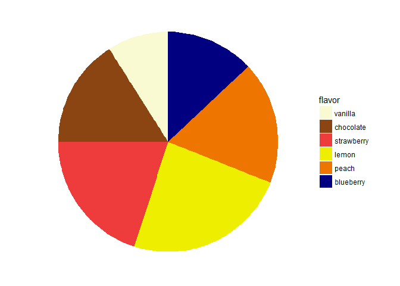
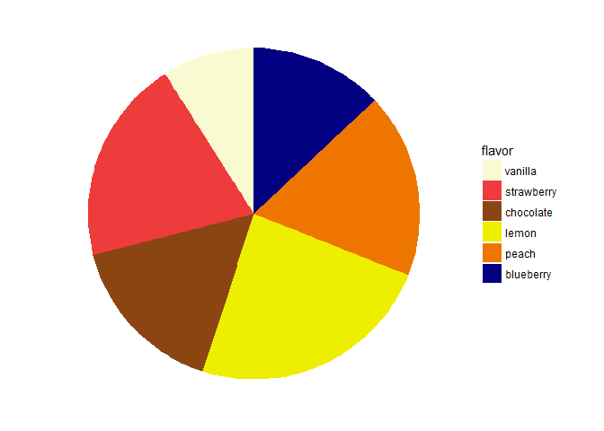
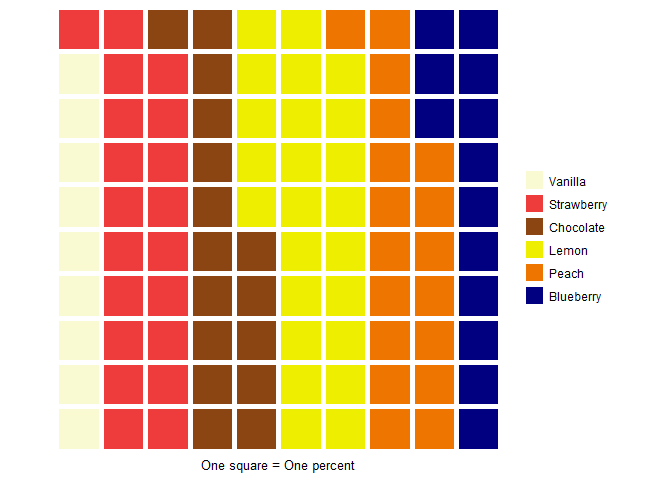
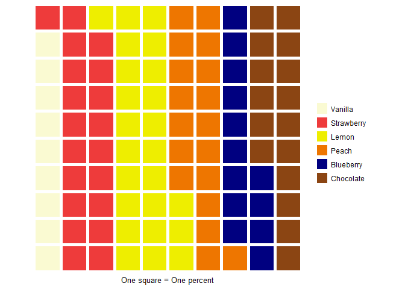
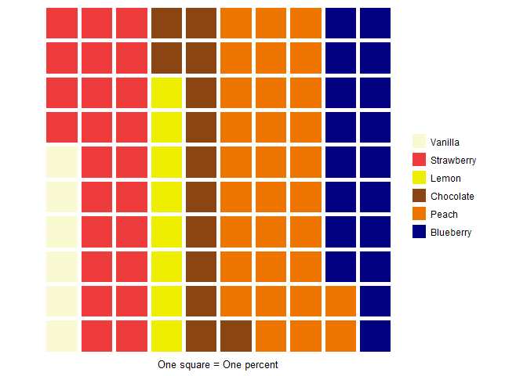
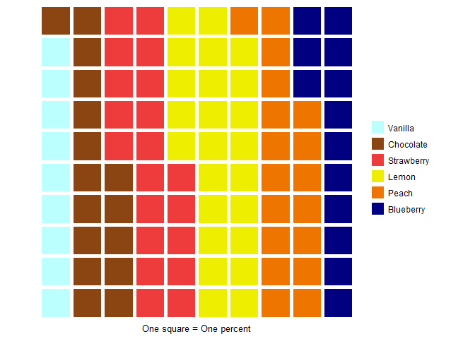

Experiment
================
Rodrigo Valdes Ortiz
4/23/2018

``` r
# General issues
blank_theme <- theme_minimal()+
  theme(
  axis.title.x = element_blank(),
  axis.title.y = element_blank(),
  panel.border = element_blank(),
  panel.grid=element_blank(),
  axis.ticks = element_blank(),
  plot.title=element_text(size=14, face="bold")
  )
```

``` r
# Function to create  pie
pie_function <- function(df, order, color_baseline, flavor) {
  
  # Factor (the first thing is the input, the order is in the second)
  df$flavor <- factor(df$flavor, flavor[order])
  color_array <- color_baseline[order]
  
  bp <- ggplot(df, aes(x="", y=number, fill = flavor)) + 
    geom_bar(width = 1, stat = "identity")

  pie <- bp + coord_polar("y", start=0)

  pie +  
    blank_theme + theme(axis.text.x=element_blank()) + 
    scale_fill_manual(values= color_array)
}
```

5. Sum of slices
================

Question: Which proportion of customers buy chocolate or vanilla?

Intuition: the distance among two slices might affect the ability to sum quantities

``` r
order_1 = c(1,2,3,4,5,6)
order_2 = c(1,3,2,4,5,6)
order_3 = c(1,3,4,2,5,6)
order_4 = c(1,3,4,5,2,6)
order_5 = c(1,3,4,5,6,2)

color_baseline = c("lightgoldenrodyellow", "chocolate4", "brown2", "yellow2", "darkorange2", "navy")
```

5.1 Sample 1: similar slice size
--------------------------------

``` r
flavor <- c('vanilla','chocolate','strawberry', 'lemon', 'peach', 'blueberry')
# number <- c(10, 20, 18, 22, 30)
number <- c(9, 16, 20, 24, 18, 13)
five_df <- data.frame(flavor, number)

pie_function(five_df, order_1, color_baseline, flavor)
```



``` r
pie_function(five_df, order_2, color_baseline, flavor)
```



``` r
pie_function(five_df, order_3, color_baseline, flavor)
```


``` r
pie_function(five_df, order_4, color_baseline, flavor)
```


``` r
pie_function(five_df, order_5, color_baseline, flavor)
```


``` r
five1_waffle <- c(`Vanilla` =9,
                 `Chocolate` =16,
                 `Strawberry` = 20,
                 `Lemon` =24,
                 `Peach` =18,
                 `Blueberry` =13)

five2_waffle <- c(`Vanilla` =9,
                 `Strawberry` = 20,
                 `Chocolate` =16,
                 `Lemon` =24,
                 `Peach` =18,
                 `Blueberry` =13)

five3_waffle <- c(`Vanilla` =9,
                  `Strawberry` = 20,
                  `Lemon` =24,
                 `Chocolate` =16,
                 `Peach` =18,
                 `Blueberry` =13)

five4_waffle <- c(`Vanilla` =9,
                  `Strawberry` = 20,
                  `Lemon` =24,
                 `Peach` =18,
                 `Chocolate` =16,
                 `Blueberry` =13)

five5_waffle <- c(`Vanilla` =9,
                 `Strawberry` = 20,
                 `Lemon` =24,
                 `Peach` =18,
                 `Blueberry` =13,
                 `Chocolate` =16)
                 

waffle(five1_waffle,
       rows = 10,
       xlab = "One square = One percent",
       colors = c("lightgoldenrodyellow", "chocolate4", "brown2", "yellow2", "darkorange2", "navy"))
```


``` r
waffle(five2_waffle,
       rows = 10,
       xlab = "One square = One percent",
       colors = c("lightgoldenrodyellow", "brown2", "chocolate4", "yellow2", "darkorange2", "navy"))
```



``` r
waffle(five3_waffle,
       rows = 10,
       xlab = "One square = One percent",
       colors = c("lightgoldenrodyellow", "brown2", "yellow2", "chocolate4", "darkorange2", "navy"))
```


``` r
waffle(five4_waffle,
       rows = 10,
       xlab = "One square = One percent",
       colors = c("lightgoldenrodyellow", "brown2", "yellow2", "darkorange2", "chocolate4", "navy"))
```


``` r
waffle(five5_waffle,
       rows = 10,
       xlab = "One square = One percent",
       colors = c("lightgoldenrodyellow", "brown2", "yellow2", "darkorange2", "navy", "chocolate4"))
```

 \#\# 5.2 Sample 2: different slice sizes

``` r
# number <- c(5,8,12,47,28)
number <- c(6, 13, 24, 8, 31, 18)
five_df_2 <- data.frame(flavor, number)

pie_function(five_df_2, order_1, color_baseline, flavor)
```


``` r
pie_function(five_df_2, order_2, color_baseline, flavor)
```


``` r
pie_function(five_df_2, order_3, color_baseline, flavor)
```


``` r
pie_function(five_df_2, order_4, color_baseline, flavor)
```


``` r
pie_function(five_df_2, order_5, color_baseline, flavor)
```


``` r
five1_waffle1 <- c(`Vanilla` =6,
                 `Chocolate` =13,
                 `Strawberry` = 24,
                 `Lemon` =8,
                 `Peach` =31,
                 `Blueberry` =18)

five2_waffle2 <- c(`Vanilla` =6,
                 `Strawberry` =24,
                 `Chocolate` =13,
                 `Lemon` =8,
                 `Peach` =31,
                 `Blueberry` =18)

five3_waffle3 <- c(`Vanilla` =6,
                  `Strawberry` =24,
                  `Lemon` =8,
                 `Chocolate` =13,
                 `Peach` =31,
                 `Blueberry` =18)

five4_waffle4 <- c(`Vanilla` =6,
                  `Strawberry` = 24,
                  `Lemon` =8,
                 `Peach` =31,
                 `Chocolate` =13,
                 `Blueberry` =18)

five5_waffle5 <- c(`Vanilla` =6,
                 `Strawberry` = 24,
                 `Lemon` =8,
                 `Peach` =31,
                 `Blueberry` =18,
                 `Chocolate` =13)
                 

waffle(five1_waffle1,
       rows = 10,
       xlab = "One square = One percent",
       colors = c("lightgoldenrodyellow", "chocolate4", "brown2", "yellow2", "darkorange2", "navy"))
```


``` r
waffle(five2_waffle2,
       rows = 10,
       xlab = "One square = One percent",
       colors = c("lightgoldenrodyellow", "brown2", "chocolate4", "yellow2", "darkorange2", "navy"))
```


``` r
waffle(five3_waffle3,
       rows = 10,
       xlab = "One square = One percent",
       colors = c("lightgoldenrodyellow", "brown2", "yellow2", "chocolate4", "darkorange2", "navy"))
```



``` r
waffle(five4_waffle4,
       rows = 10,
       xlab = "One square = One percent",
       colors = c("lightgoldenrodyellow", "brown2", "yellow2", "darkorange2", "chocolate4", "navy"))
```


``` r
waffle(five5_waffle5,
       rows = 10,
       xlab = "One square = One percent",
       colors = c("lightgoldenrodyellow", "brown2", "yellow2", "darkorange2", "navy", "chocolate4"))
```


6. Prior ideas about colors might change perception
===================================================

Question: Which is the proportion of customers who buy vanilla?

Intuition: Ideas about the correctness of color labeling might affect comprehension

6.1 Only the color of the question is wrong
-------------------------------------------

``` r
flavor <- c('vanilla','chocolate','strawberry', 'lemon', 'peach', 'blueberry')
number <- c(9, 16, 20, 24, 18, 13)

six_df <- data.frame(flavor, number)
color_baseline_six = c("paleturquoise1", "chocolate4", "brown2", "yellow2", "darkorange2", "navy")

pie_function(six_df, order_1, color_baseline_six, flavor)
```


``` r
six1_waffle <- c(`Vanilla` =9,
                 `Chocolate` =16,
                 `Strawberry` =20,
                 `Lemon` =24,
                 `Peach` = 18,
                 `Blueberry` =13)
                 

waffle(six1_waffle,
       rows = 10,
       xlab = "One square = One percent",
       colors = c("paleturquoise1", "chocolate4", "brown2", "yellow2", "darkorange2", "navy"))
```



6.2 Only the color of question is right
---------------------------------------

``` r
color_baseline_six_3 = c("lightgoldenrodyellow", "navy", "chocolate4", "brown2", "yellow2", "darkorange2")

pie_function(six_df, order_1, color_baseline_six_3, flavor)
```


``` r
six2_waffle <- c(`Vanilla` =9,
                 `Blueberry` =13,
                 `Peach` = 18,
                 `Lemon` =24,
                 `Strawberry` =20,
                 `Chocolate` =16)

waffle(six2_waffle,
       rows = 10,
       xlab = "One square = One percent",
       colors = c("lightgoldenrodyellow", "navy", "chocolate4", "brown2", "yellow2", "darkorange2"))
```


6.3 All colors are wrong
------------------------

``` r
color_baseline_six_2 = c("chocolate4", "lightgoldenrodyellow", "navy", "brown2", "yellow2", "darkorange2")

pie_function(six_df, order_1, color_baseline_six_2, flavor)
```


``` r
six3_waffle <- c(`Vanilla` =9,
                 `Chocolate` =16,
                 `Strawberry` =20,
                 `Lemon` =24,
                 `Peach` = 18,
                 `Blueberry` =13)

waffle(six3_waffle,
       rows = 10,
       xlab = "One square = One percent",
       colors = c("lightgoldenrodyellow", "navy", "chocolate4", "brown2", "yellow2", "darkorange2"))
```


