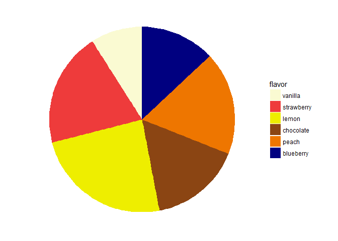
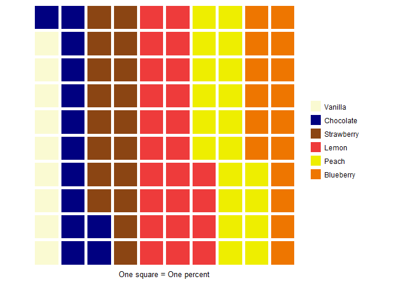
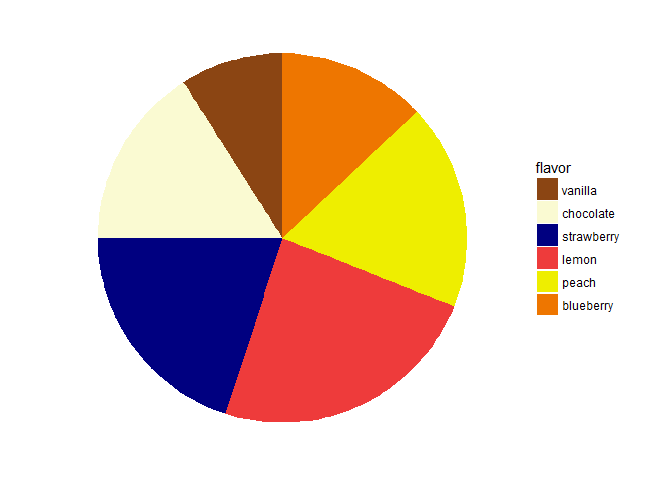
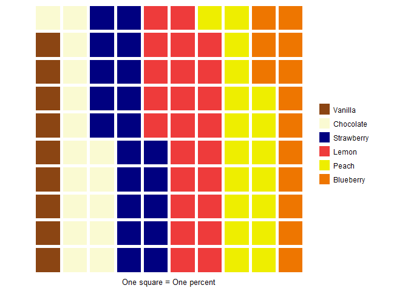

Experiment
================
Rodrigo Valdes Ortiz
4/23/2018

``` r
# General issues
blank_theme <- theme_minimal()+
  theme(
  axis.title.x = element_blank(),
  axis.title.y = element_blank(),
  panel.border = element_blank(),
  panel.grid=element_blank(),
  axis.ticks = element_blank(),
  plot.title=element_text(size=14, face="bold")
  )
```

``` r
# Function to create  pie
pie_function <- function(df, order, color_baseline, flavor) {
  
  df$flavor <- factor(df$flavor, flavor[order])
  color_array <- color_baseline[order]
  
  bp <- ggplot(df, aes(x="", y=number, fill = flavor)) + 
    geom_bar(width = 1, stat = "identity")

  pie <- bp + coord_polar("y", start=0)

  pie +  
    blank_theme + theme(axis.text.x=element_blank()) + 
    scale_fill_manual(values= color_array)
}
```

``` r
flavor <- c('vanilla','chocolate','strawberry', 'lemon', 'orange')
number <- c(10, 20, 18, 22, 30)
order_1 = c(1,2,3,4,5)
order_2 = c(2,1,3,4,5)
order_3 = c(3,2,1,4,5)
order_4 = c(4,2,3,1,5)

five_df <- data.frame(flavor, number)
# Factor (the first thing is the input, the order is in the second)

color_baseline = c("lightgoldenrodyellow", "chocolate4", "brown2", "yellow2", "darkorange2")
```

``` r
pie_function(five_df, order_1, color_baseline, flavor)
```


``` r
pie_function(five_df, order_2, color_baseline, flavor)
```


``` r
pie_function(five_df, order_3, color_baseline, flavor)
```



``` r
pie_function(five_df, order_4, color_baseline, flavor)
```


``` r
number <- c(5,8,12,47,28)
five_df_2 <- data.frame(flavor, number)

pie_function(five_df_2, order_1, color_baseline, flavor)
```


``` r
pie_function(five_df_2, order_2, color_baseline, flavor)
```


``` r
pie_function(five_df_2, order_3, color_baseline, flavor)
```


``` r
pie_function(five_df_2, order_4, color_baseline, flavor)
```


``` r
flavor <- c('vanilla','chocolate','strawberry', 'lemon', 'orange')
number <- c(10, 20, 18, 22, 30)

six_df <- data.frame(flavor, number)
color_baseline_six = c("lightgoldenrodyellow", "chocolate4", "skyblue3", "yellow2", "darkorange2")

pie_function(six_df, order_1, color_baseline_six, flavor)
```


``` r
pie_function(six_df, order_2, color_baseline_six, flavor)
```


``` r
pie_function(six_df, order_3, color_baseline_six, flavor)
```


``` r
pie_function(six_df, order_4, color_baseline_six, flavor)
```


``` r
# flavor <- c('vanilla','chocolate','strawberry', 'lemon', 'orange')

color_baseline_six_2 = c("chocolate4", "lightgoldenrodyellow", "yellow2", "darkorange2", "brown2")

pie_function(six_df, order_1, color_baseline_six_2, flavor)
```


``` r
pie_function(six_df, order_2, color_baseline_six_2, flavor)
```



``` r
pie_function(six_df, order_3, color_baseline_six_2, flavor)
```


``` r
pie_function(six_df, order_4, color_baseline_six_2, flavor)
```


``` r
flavor <- c('mint','chocolate','strawberry', 'lemon', 'orange')
six_df_3 <- data.frame(flavor, number)
color_baseline_six_3 = c("cornflowerblue", "lightgoldenrodyellow", "yellow2", "darkorange2", "brown2")

pie_function(six_df_3, order_1, color_baseline_six_3, flavor)
```



``` r
pie_function(six_df_3, order_2, color_baseline_six_3, flavor)
```



``` r
pie_function(six_df_3, order_3, color_baseline_six_3, flavor)
```


``` r
pie_function(six_df_3, order_4, color_baseline_six_3, flavor)
```


