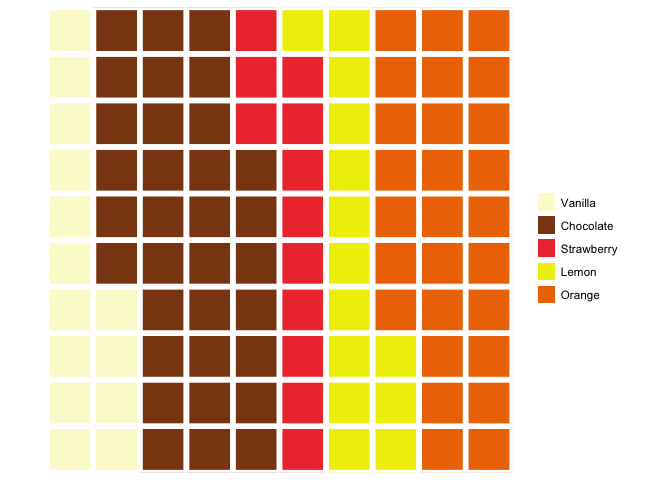

One\_Two
================
Sush
April 27, 2018

``` r
# theme
blank_theme <- theme_minimal()+
  theme(
  axis.title.x = element_blank(),
  axis.title.y = element_blank(),
  panel.border = element_blank(),
  panel.grid=element_blank(),
  axis.ticks = element_blank(),
  plot.title=element_text(size=14, face="bold")
  )
```

``` r
# Function to create  pie
pie_function <- function(number, order, color_baseline, flavor) {
  
  df <- data.frame(flavor, number)
  df$flavor <- factor(df$flavor, flavor[order])
  color_array <- color_baseline[order]
  
  ggplot(df, aes(x="", y=number, fill = flavor)) + 
    geom_bar(width = 1, stat = "identity") +
    coord_polar("y", start=0)+
    blank_theme + theme(axis.text.x=element_blank()) + 
    scale_fill_manual(values= color_array)
}
```

1. Does the perception of the size of one slice depend on the size of the other slices?
=======================================================================================

``` r
flavor <- c('vanilla','chocolate','strawberry', 'lemon', 'orange')
order = c(1,2,3,4,5)
#df <- data.frame(flavor, number)
color_baseline = c("lightgoldenrodyellow", "chocolate4", "brown2", "yellow2", "darkorange2")


# Question : What proportion of respondents like chocolate ice-cream?

pie_function(c(14, 17, 21, 23,25 ), order, color_baseline, flavor)
```


``` r
waffle(c(`Vanilla` = 14,
          `Chocolate` = 17,
          `Strawberry` = 21,
          `Lemon` = 23,
          `Orange` = 25),
       rows = 10,
       colors = c("lightgoldenrodyellow", "chocolate4", "brown2", "yellow2", "darkorange2"))
```


``` r
pie_function(c(14, 33, 12, 14, 27), order, color_baseline, flavor)
```


``` r
waffle(c(`Vanilla` = 14,
          `Chocolate` = 33,
          `Strawberry` = 12,
          `Lemon` = 14,
          `Orange` = 27),
       rows = 10,
       colors = c("lightgoldenrodyellow", "chocolate4", "brown2", "yellow2", "darkorange2"))
```



``` r
pie_function(c(14, 13, 12, 20, 41), order, color_baseline, flavor)
```


``` r
waffle(c(`Vanilla` = 14,
          `Chocolate` = 13,
          `Strawberry` = 12,
          `Lemon` = 20,
          `Orange` = 41),
       rows = 10,
       colors = c("lightgoldenrodyellow", "chocolate4", "brown2", "yellow2", "darkorange2"))
```


``` r
pie_function(c(14, 30, 12, 30, 14), order, color_baseline, flavor)
```


``` r
waffle(c(`Vanilla` = 14,
          `Chocolate` = 30,
          `Strawberry` = 12,
          `Lemon` = 30,
          `Orange` = 14),
       rows = 10,
       colors = c("lightgoldenrodyellow", "chocolate4", "brown2", "yellow2", "darkorange2"))
```


2. Does the total number of observations affect the reader's ability to estimate sizes?
=======================================================================================

``` r
number <- c(14, 17, 21, 23, 25)
df <- data.frame(flavor, number)
df$flavor <- factor(df$flavor, flavor[order])
color_array <- color_baseline[order]
  
ggplot(df, aes(x="", y=number, fill = flavor)) + 
  geom_bar(width = 1, stat = "identity") +
  coord_polar("y", start=0)+
  blank_theme + theme(axis.text.x=element_blank()) + 
  scale_fill_manual(values= color_array) +
  ggtitle("Number of Respondents : 1000")
```


``` r
waffle(c(`Vanilla` = 14,
          `Chocolate` = 17,
          `Strawberry` = 21,
          `Lemon` = 23,
          `Orange` = 25),
       rows = 10,
       colors = c("lightgoldenrodyellow", "chocolate4", "brown2", "yellow2", "darkorange2"),
       title = "Number of Respondents: 1000")
```


``` r
number <- c(14, 17, 21, 23, 25)
df <- data.frame(flavor, number)
df$flavor <- factor(df$flavor, flavor[order])
color_array <- color_baseline[order]
  
ggplot(df, aes(x="", y=number, fill = flavor)) + 
  geom_bar(width = 1, stat = "identity") +
  coord_polar("y", start=0)+
  blank_theme + theme(axis.text.x=element_blank()) + 
  scale_fill_manual(values= color_array) +
  ggtitle("Number of Respondents : 874")
```


``` r
waffle(c(`Vanilla` = 14,
          `Chocolate` = 17,
          `Strawberry` = 21,
          `Lemon` = 23,
          `Orange` = 25),
       rows = 10,
       colors = c("lightgoldenrodyellow", "chocolate4", "brown2", "yellow2", "darkorange2"),
       title = "Number of Respondents: 874")
```


