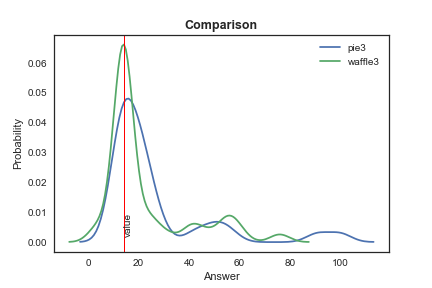
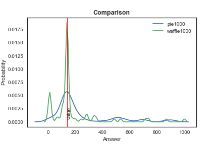

```{r setup, include=FALSE}
knitr::opts_chunk$set(echo = TRUE)
library(tidyverse)
```

## Pies versus Waffles


### Introduction

This experiment has as its main goal to compare how different visualisation strategies affect perception of proportions. To do so, two different types of charts will be used, pie charts and waffle charts. Since pie charts are notoriously hard to read (Cairo, 2016), this should provide an interesting exercise. However, since it is one of the most familiar plots (idem), it is also one that should be given attention and have its functionality questioned.

To get the users to focus solely on the proportions, we used made-up data about preferences for ice cream flavours, since this should prove uncontroversial. To provide some variation, flavours and proportions vary along the experiment, but are overall consistent. The questions were prepared in Qualtrics and randomisation was used to set up the questions. A timer of 15 seconds per question was also set up, but it did not work as intended.

In order to explore this issue to the fullest, we shall also try to determine whether order and colour have an effect on the perception of proportion. To do so, the order in which the flavours are presented will be altered, as well as the colours for the flavours themselves. While they usually are labeled according to a colour that would be easily associated with the flavour, for some questions some (or all) will be mislabeled.

The survey ran for 5 days and a total of 210 surveys were considered for this analysis. 


#### Questions 1 & 2

Proportions. 1 is with pie charts, 2 is with waffle charts.

Option  1

Sample Size Pie: 40

Sample Size Waffle: 45

ttest_ind:            t = -0.364234  p = 0.71661

cohen's d:  -0.07880321382387548

Pie Exact Accuracy:  0.05

Waffle Exact Accuracy:  0.4666666666666667


Pie Accuracy within 2 units:  0.425

Waffle Accuracy within 2 units:  0.6222222222222222
******************************
Option  2

Sample Size Pie: 48

Sample Size Waffle: 36

ttest_ind:            t = 1.26233  p = 0.210589

cohen's d:  0.2769648261581617

Pie Exact Accuracy:  0.0625

Waffle Exact Accuracy:  0.7222222222222222


Pie Accuracy within 2 units:  0.3333333333333333

Waffle Accuracy within 2 units:  0.8055555555555556


******************************
Option  3

Sample Size Pie: 32

Sample Size Waffle: 40

ttest_ind:            t = 0.758422  p = 0.451261

cohen's d:  0.18217193737817916

Pie Exact Accuracy:  0.0625

Waffle Exact Accuracy:  0.55


Pie Accuracy within 2 units:  0.40625

Waffle Accuracy within 2 units:  0.65



******************************

Option  4

Sample Size Pie: 45

Sample Size Waffle: 50

ttest_ind:            t = 0.218429  p = 0.827576

cohen's d:  0.044834330848297604

Pie Exact Accuracy:  0.06666666666666667

Waffle Exact Accuracy:  0.62

Pie Accuracy within 2 units:  0.4666666666666667

Waffle Accuracy within 2 units:  0.72


******************************

Sample Size Pie: 72

Sample Size Waffle: 69

N =  1000

ttest_ind:            t = 1.61739  p = 0.108075

cohen's d:  0.2721334444241711

Pie Exact Accuracy:  0.013888888888888888

Waffle Exact Accuracy:  0.0


Pie Accuracy within 2 units:  0.1111111111111111

Waffle Accuracy within 2 units:  0.42028985507246375

Pie Accuracy within 5 units:  0.16666666666666666

Waffle Accuracy within 5 units:  0.42028985507246375


******************************

Sample Size Pie: 68

Sample Size Waffle: 60

N =  874

ttest_ind:            t = -0.0784656  p = 0.937585

cohen's d:  -0.013906615254077681

Pie Exact Accuracy:  0.014705882352941176

Waffle Exact Accuracy:  0.18333333333333332


Pie Accuracy within 2 units:  0.058823529411764705

Waffle Accuracy within 2 units:  0.26666666666666666

Pie Accuracy within 5 units:  0.10294117647058823

Waffle Accuracy within 5 units:  0.3


******************************

The first step was investigating how accurately people are able to assess the proportion out of a whole by comparing pie charts vs waffles. When the number was 1000, the difference in means was statistically significant (10%), with a small effect size as indicated by a Cohen’s d value of 0.27. This means that people are much better at estimating with waffles. However, with a non-round n of 874, this difference disappears. It must be said that exact accuracy is low, but this likely because the way to input the answer was using a slider bar, so accuracy within two units was high. For example, when a correct answer was 140, there are a large number of answers that are either 139 or 141. In both cases, accuracies are higher for waffles than pies. 


#### Questions 3 & 4

Effects of adjacency on perception. 3 is with pie charts, 4 with waffle charts.

Adjacent

Sample Size Pie: 93

Sample Size Waffle: 110

ttest_ind:            t = 2.01377  p = 0.0455989

cohen's d:  0.2866735113300187

Pie Exact Accuracy:  0.7741935483870968

Waffle Exact Accuracy:  0.8818181818181818



******************************

Opposite

Sample Size Pie: 74

Sample Size Waffle: 64

ttest_ind:            t = 3.24751  p = 0.00148098

cohen's d:  0.5472657706348194

Pie Exact Accuracy:  0.6486486486486487

Waffle Exact Accuracy:  0.875


******************************

Afterwards, assessing the size of adjacent slices with visibly different proportions was tested.  The difference between pies and waffles was statistically significant in both cases, with p = 0.04, and p = 0.001 respectively. People were able to assess the size more accurately with waffles than pies for both cases. The effect size was small when slices were adjacent (Cohen’s d = 0.2866), but medium when they were not (Cohen’s d = 0.5472). 
It can also be inferred that it is easier to compare slices when they are adjacent, as can be seen from the statistically significant, and the small effect size. Accuracy also rises for adjacent slices.
When looking at waffles specifically, there is hardly any difference, but both accuracies are still higher than those of corresponding pies.


#### Questions 5 & 6

Adjacency with similar proportions. 5 is with pie charts, 6 is with waffle charts.

Adjacent

Sample Size Pie: 65

Sample Size Waffle: 72

ttest_ind:            t = 1.64543  p = 0.102319

cohen's d:  0.28237286698646813

Pie Exact Accuracy:  0.27692307692307694

Waffle Exact Accuracy:  0.5138888888888888

Pie Accuracy within 2 units:  0.38461538461538464

Waffle Accuracy within 2 units:  0.5694444444444444


******************************

Not Adjacent

Sample Size Pie: 113

Sample Size Waffle: 108

ttest_ind:            t = 1.01656  p = 0.310487

cohen's d:  0.1368240306296562

Pie Exact Accuracy:  0.168141592920354

Waffle Exact Accuracy:  0.42592592592592593

Pie Accuracy within 2 units:  0.25663716814159293

Waffle Accuracy within 2 units:  0.5462962962962963


******************************

PIES

Adjacent vs Opposite pies

Sample Size adjacent 65

Sample Size opposite 113

ttest_ind:            t = 0.179413  p = 0.857905

cohen's d:  0.02824924659044252

Adjacent Exact Accuracy:  0.27692307692307694

Opposite Exact Accuracy:  0.168141592920354

Adjacent Accuracy within 2 units:  0.38461538461538464

Opposite Accuracy within 2 units:  0.25663716814159293

Adjacent vs Opposite waffles

Sample Size adjacent 72

Sample Size opposite 108

ttest_ind:            t = -0.82105  p = 0.412859

cohen's d:  -0.12429460517179482

Adjacent Accuracy:  0.5138888888888888

Opposite Accuracy:  0.42592592592592593

Adjacent Accuracy within 2 units:  0.5694444444444444

Opposite Accuracy within 2 units:  0.5462962962962963

The next step was meassuring for adjacency again, but with slices of similar size. The results show that adjacent waffles are better than adjacent pies, with a p value of 0.1, which indicates a small effect size. Accuracy is, however, higher in both cases when adjacent. When slices are not so, the difference is statistically not significant, but waffle charts retain an edge.
The difference between pies with adjacent slices and not adjacent is not statiscally significant, and adjacency does not seem to play too large a role in determining the proportion for waffle charts.

Adjacent

Sample Size Pie: 71

Sample Size Waffle: 77

ttest_ind:            t = 2.81039  p = 0.00570223

cohen's d:  0.4647176463950014

Pie Exact Accuracy:  0.07042253521126761

Waffle Exact Accuracy:  0.03896103896103896

Pie Accuracy within 2 units:  0.1267605633802817

Waffle Accuracy within 2 units:  0.03896103896103896


******************************

Not Adjacent

Sample Size Pie: 97

Sample Size Waffle: 97

ttest_ind:            t = -1.11553  p = 0.266111

cohen's d:  -0.16018103601792638

Pie Exact Accuracy:  0.13402061855670103

Waffle Exact Accuracy:  0.0

Pie Accuracy within 2 units:  0.24742268041237114

Waffle Accuracy within 2 units:  0.020618556701030927


******************************

When summing slices of different sizes, the difference was very significant when comparing pie charts vs waffle charts (p=0.005). Cohen's d value of 0.46 points to a medium effect size.However, this difference disappears when there is no adjacency; both perform poorly, even when considering for accuracy within two units.

PIES

Adjacent vs Opposite pies

Sample Size adjacent 71

Sample Size opposite 97

ttest_ind:            t = 1.62227  p = 0.107009

cohen's d:  0.2558686748598827

Adjacent Exact Accuracy:  0.07042253521126761

Opposite Exact Accuracy:  0.13402061855670103

Adjacent Accuracy within 2 units:  0.1267605633802817

Opposite Accuracy within 2 units:  0.24742268041237114

When comparing adjacent slices versus slices that are in an opposite position, the p-value of 0.1 shows statistical significance and higher accuracy. However, results also seems to show that it is better to have non-adjacent slices than those that are.

#### Questions 7 & 8

Finally, this questions concern themselves on whether having correct labels makes any difference. There are several options taking place here, either all labels are correct, none are, the one about which the question is asked is the only correct one, or the only incorrect one.

Only vanilla is wrong

Sample Size Pie: 52

Sample Size Waffle: 56

ttest_ind:            t = -0.876074  p = 0.383138

cohen's d:  -0.16758486654130628

Pie Exact Accuracy:  0.07692307692307693

Waffle Exact Accuracy:  0.6428571428571429


Pie Accuracy within 2 units:  0.5

Waffle Accuracy within 2 units:  0.7321428571428571


******************************

Vanilla is right, the rest are wrong

Sample Size Pie: 48

Sample Size Waffle: 48

ttest_ind:            t = 0.900997  p = 0.369927

cohen's d:  0.18391515053935278

Pie Exact Accuracy:  0.041666666666666664

Waffle Exact Accuracy:  0.625


Pie Accuracy within 2 units:  0.3958333333333333

Waffle Accuracy within 2 units:  0.6875


******************************

All are wrong

Sample Size Pie: 59

Sample Size Waffle: 56

ttest_ind:            t = 0.481192  p = 0.631312

cohen's d:  0.08976504305950662

Pie Exact Accuracy:  0.01694915254237288

Waffle Exact Accuracy:  0.21428571428571427

Pie Accuracy within 2 units:  0.1864406779661017

Waffle Accuracy within 2 units:  0.23214285714285715

******************************

From these results, no clear difference between pie charts and waffle pies emerges.

Pie 1 has only one colour wrongly assigned, pie 2 has all but one, and pie 3 has every single one mislabelled.

Testing between 1 and 2 throws these results:

ttest_ind:            t = -1.84585  p = 0.0686893

cohen's d:  -0.3726061962862755

p1 Exact Accuracy:  0.07692307692307693

p2 Exact Accuracy:  0.041666666666666664

p1 Accuracy within 2 units:  0.5

p2 Accuracy within 2 units:  0.3958333333333333


Thus, pie 1 is assessed more correctly than pie 2, with p = 0.06, and effect size of 0.37.

Between 2 an 3, these results come up:

ttest_ind:            t = -0.418012  p = 0.677073

cohen's d:  -0.08283142264328558

p3 Exact Accuracy:  0.01694915254237288

p2 Exact Accuracy:  0.041666666666666664

p3 Accuracy within 2 units:  0.1864406779661017

p2 Accuracy within 2 units:  0.3958333333333333

Between 1 and 3, these:

ttest_ind:            t = 1.9517  p = 0.0535532

cohen's d:  0.37060457019253235

p3 Exact Accuracy:  0.01694915254237288

p1 Exact Accuracy:  0.07692307692307693

p3 Accuracy within 2 units:  0.1864406779661017

p1 Accuracy within 2 units:  0.5

All in all, this shows once again that pie 1 is better than pie 2 for these purposes. This difference is statistically significant and associated with a Cohen's d of 0.37. It must be mentioned, once again, that accuracy within two units is much higher, which can be attributed to the slider scale.

# Between 1+3 and 2 *This has no explanation, I do not quite understand it.

p_wrong = p1.append(p3)

p_right = p2

t, p = ttest_ind(p_wrong, p_right, equal_var= False)

cohen = cohens_d(p_wrong,p_right)


print("ttest_ind:            t = %g  p = %g" % (t, p))

print("cohen's d: ", cohen)

print("p_wrong Exact Accuracy: ", exact_accuracy(p_wrong,correct))

print("p_right Exact Accuracy: ", exact_accuracy(p_right,correct))

print("p_wrong Accuracy within 2 units: ", accuracy(p_wrong,correct,2))

print("p_right Accuracy within 2 units: ", accuracy(p_right,correct,2))

ttest_ind:            t = -1.16653  p = 0.247636

cohen's d:  -0.21660162551378484

p_wrong Exact Accuracy:  0.04504504504504504

p_right Exact Accuracy:  0.041666666666666664

p_wrong Accuracy within 2 units:  0.3333333333333333

p_right Accuracy within 2 units:  0.3958333333333333

As for waffle charts, keeping the same pattern, the following results appear:

1 & 2

ttest_ind:            t = -0.0304957  p = 0.975732

cohen's d:  -0.005988255358113585

p1 Exact Accuracy:  0.6428571428571429

p2 Exact Accuracy:  0.625

p1 Accuracy within 2 units:  0.7321428571428571

p2 Accuracy within 2 units:  0.6875

2 & 3

ttest_ind:            t = 0.278807  p = 0.781061

cohen's d:  0.05542716933143575

p3 Exact Accuracy:  0.21428571428571427

p2 Exact Accuracy:  0.625

p3 Accuracy within 2 units:  0.23214285714285715

p2 Accuracy within 2 units:  0.6875

1 & 3

ttest_ind:            t = 0.320592  p = 0.74919

cohen's d:  0.060586120078777846

p3 Exact Accuracy:  0.21428571428571427

p1 Exact Accuracy:  0.6428571428571429

p3 Accuracy within 2 units:  0.23214285714285715

p1 Accuracy within 2 units:  0.7321428571428571

1+3 & 2

ttest_ind:            t = 0.127743  p = 0.898666

cohen's d:  0.02246623238251375

p_wrong Exact Accuracy:  0.42857142857142855

p_right Exact Accuracy:  0.625

p_wrong Accuracy within 2 units:  0.48214285714285715

p_right Accuracy within 2 units:  0.6875


From these, nothing noteworthy is observed.

### Conclusions

All in all, waffle charts allow for greater accuracy than pie charts. All throught the range of questions, they consistently outperformed the pie charts. However, the failure of the timing variable to work as intended might have had some effect which we could not observe. 

