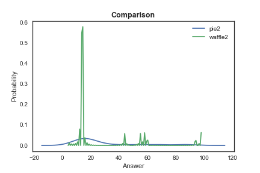
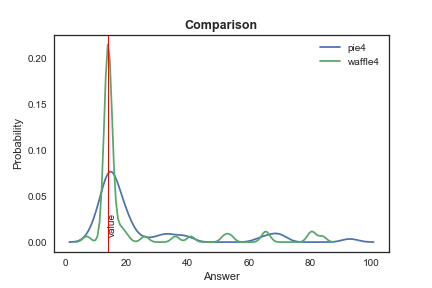
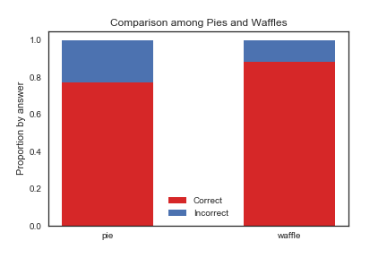
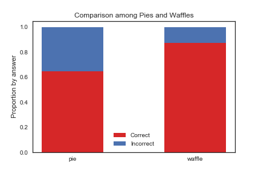
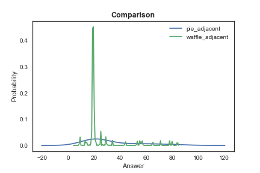
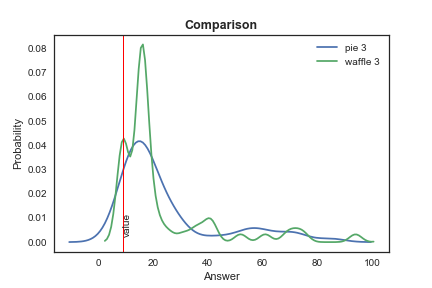

```{r setup, include=FALSE}
knitr::opts_chunk$set(echo = TRUE)
library(tidyverse)
```

### Introduction

This experiment has as its main goal to compare how different visualisation strategies affect perception of proportions. To do so, two different types of charts will be used, pie charts and waffle charts. Since pie charts are notoriously hard to read (Cairo, 2016), this should provide an interesting exercise. However, since it is one of the most familiar plots (idem), it is also one that should be given attention and have its functionality questioned.

To get the users to focus solely on the proportions, we used made-up data about preferences for ice cream flavours, since this should prove uncontroversial. To provide some variation, flavours and proportions vary along the experiment, but are overall consistent. The questions were prepared in Qualtrics and randomisation was used to set up the questions. A timer of 15 seconds per question was also set up, but it did not work as intended.

In order to explore this issue to the fullest, we shall also try to determine whether order and colour have an effect on the perception of proportion. To do so, the order in which the flavours are presented will be altered, as well as the colours for the flavours themselves. While they usually are labeled according to a colour that would be easily associated with the flavour, for some questions some (or all) will be mislabeled.

The survey ran for 5 days and a total of 210 surveys were considered for this analysis. We collected about 40 responses per question.

### Methodology

We set up five experiments to test waffle and pie charts in five different situations. The main question behind these experiments was to find out which of the two graphs provides the most accurate information, defined as the deviation of the real data to the perception of the reader. 

For all the cases, we used up to six different flavors of ice cream to label our graphs. For each case, we used the same data and order to create a pie chart and a waffle chart. Then, we were able to compare the performance of a waffle chart versus a pie chart. In addition, in some cases, we compared the performance of slight variations of a pie or waffle chart.

To asses the difference between two vectors of results, we used four main tools. First, we use a simple t-test for difference in the means. Second, we utilized the Cohen's d, which a measure that indicates the standardized difference among two means. That is to say, it is the difference in the means divided by the pooled standard deviation. Third, we built a measure of exact accuracy, which is the proportion of exactly correct answers. Fourth, we used a measure of accuracy with X units, where an answer is considered correct if it is X units above or below the exactly correct answer.


## Experiment 1

**Does the perception of the size of a slice -area- depends on the size of the other slices -areas-?**

We fixed the size of one slice -area– (vanilla), and changed the size of all the other slices –areas– in different ways. Intuitively, the best chart should represent the same data no matter if the size of the other slices –areas– changed. We tested four different combinations for the sizes of other slices –areas–. The pie 1 uses the same data as the waffle 1, an so on.

*Option 1*

Sample Size Pie: 40

Sample Size Waffle: 45

ttest_ind:            t = -0.364234  p = 0.71661

cohen's d:  -0.07880321382387548

Pie Exact Accuracy:  0.05

Waffle Exact Accuracy:  0.4666666666666667


Pie Accuracy within 2 units:  0.425

Waffle Accuracy within 2 units:  0.6222222222222222
******************************
*Option  2*

Sample Size Pie: 48

Sample Size Waffle: 36

ttest_ind:            t = 1.26233  p = 0.210589

cohen's d:  0.2769648261581617

Pie Exact Accuracy:  0.0625

Waffle Exact Accuracy:  0.7222222222222222


Pie Accuracy within 2 units:  0.3333333333333333

Waffle Accuracy within 2 units:  0.8055555555555556



******************************
*Option  3*

Sample Size Pie: 32

Sample Size Waffle: 40

ttest_ind:            t = 0.758422  p = 0.451261

cohen's d:  0.18217193737817916

Pie Exact Accuracy:  0.0625

Waffle Exact Accuracy:  0.55


Pie Accuracy within 2 units:  0.40625

Waffle Accuracy within 2 units:  0.65


******************************
*Option  4*

Sample Size Pie: 45

Sample Size Waffle: 50

ttest_ind:            t = 0.218429  p = 0.827576

cohen's d:  0.044834330848297604

Pie Exact Accuracy:  0.06666666666666667

Waffle Exact Accuracy:  0.62

Pie Accuracy within 2 units:  0.4666666666666667

Waffle Accuracy within 2 units:  0.72



******************************
**Overall results Experiment 1**

There are no significant differences between the pies and the waffles in the means. Then, there is not a definitive winner between pies and waffles. However, the exact accuracy is higher for waffles in all cases.

The higher accuracy of waffles might be caused by people counting squares, which might require more time against pies. Then, further study is needed to have a better conclusion of which graph is better when there are time constraints.


## Experiment 2


**Does the total number of observations affect the reader's ability to estimate the size of a slice –area–?**

We provided the user with a total number of individuals represented in the graph. That is to say, we mentioned that the pie –waffle– represented 1000 individuals, for example.

There are two main cases: when the total number of respondents is 1000, and when the total number of respondents is 874. The intuition behind is that 874, as a non-round number, might be more difficult to interpret. 

*Option  1*

Sample Size Pie: 72

Sample Size Waffle: 69

N =  1000

ttest_ind:            t = 1.61739  p = 0.108075

cohen's d:  0.2721334444241711

Pie Exact Accuracy:  0.013888888888888888

Waffle Exact Accuracy:  0.0


Pie Accuracy within 2 units:  0.1111111111111111

Waffle Accuracy within 2 units:  0.42028985507246375

Pie Accuracy within 5 units:  0.16666666666666666

Waffle Accuracy within 5 units:  0.42028985507246375


******************************
*Option  2*

Sample Size Pie: 68

Sample Size Waffle: 60

N =  874

ttest_ind:            t = -0.0784656  p = 0.937585

cohen's d:  -0.013906615254077681

Pie Exact Accuracy:  0.014705882352941176

Waffle Exact Accuracy:  0.18333333333333332


Pie Accuracy within 2 units:  0.058823529411764705

Waffle Accuracy within 2 units:  0.26666666666666666

Pie Accuracy within 5 units:  0.10294117647058823

Waffle Accuracy within 5 units:  0.3


******************************

The first step was investigating how accurately people are able to assess the proportion out of a whole by comparing pie charts vs waffles. When the number was 1000, the difference in means was statistically significant (10%), with a small effect size as indicated by a Cohen’s d value of 0.27. This means that people are much better at estimating with waffles. However, with a non-round n of 874, this difference disappears. It must be said that exact accuracy is low, but this likely because the way to input the answer was using a slider bar, so accuracy within two units was high. For example, when a correct answer was 140, there are a large number of answers that are either 139 or 141. In both cases, accuracies are higher for waffles than pies. 


## Experiment 3

**Does the position of the slice –area– affect the perception of its size?**

If a graph is robust, it should be so not matter where the data of certain category is located. Then, for instance, if a slice is located in the top of a pie chart –or waffle chart–, it should be perceived as being the same size as if it were in the bottom of the pie chart –waffle chart–.

For the pie chart, we fixed the location of all slices except one, which we rotate in the graph. For the waffle chart, we conducted a similar process. 

To asses the perception of size, we asked about the relative size of two slices –areas–. In specific, the question was: **is the size of the orange slice bigger than the lemon slice?**

Besides, we also conducted tests on whether adjacency to other slices affect its perception of size. To fully explore this, we used both apparently very different quantities, and those that were close enough to each other to be confusing.

*Option  1: Adjacent slices or areas*


Sample Size Pie: 93

Sample Size Waffle: 110

ttest_ind:            t = 2.01377  p = 0.0455989

cohen's d:  0.2866735113300187

Pie Exact Accuracy:  0.7741935483870968

Waffle Exact Accuracy:  0.8818181818181818



******************************

*Option  1: Opposite slices or areas*

Sample Size Pie: 74

Sample Size Waffle: 64

ttest_ind:            t = 3.24751  p = 0.00148098

cohen's d:  0.5472657706348194

Pie Exact Accuracy:  0.6486486486486487

Waffle Exact Accuracy:  0.875



******************************

**Overall results Experiment 3**

Afterwards, assessing the size of adjacent slices with visibly different proportions was tested.  The difference between pies and waffles was statistically significant in both cases, with p = 0.04, and p = 0.001 respectively. People were able to assess the size more accurately with waffles than pies for both cases. The effect size was small when slices were adjacent (Cohen’s d = 0.2866), but bigger when they were not (Cohen’s d = 0.5472). 

It can also be inferred that it is easier to compare slices when they are adjacent, as can be seen from the statistically significant, and the small effect size. Accuracy also rises for adjacent slices.

When looking at waffles specifically, there is hardly any difference, but both accuracies are still higher than those of corresponding pies.


## Experiment 4 

**Does the distance between slices affect the ability to sum?**

We ask to sum two slices –areas– in the graph. Then, we compare that number with the data. We used two cases, when the size of the slices is similar and when the size of the slices are evidently different.

In specific, the question was: **what proportion of customers prefer chocolate and vanilla?**


*Option 1: Sum adjacent slices -areas- when the size of the areas are similar*


Sample Size Pie: 65

Sample Size Waffle: 72

ttest_ind:            t = 1.64543  p = 0.102319

cohen's d:  0.28237286698646813

Pie Exact Accuracy:  0.27692307692307694

Waffle Exact Accuracy:  0.5138888888888888

Pie Accuracy within 2 units:  0.38461538461538464

Waffle Accuracy within 2 units:  0.5694444444444444



******************************

*Option 2: Sum non adjacent slices -areas- when the size of the slides -areas- are similar*

Sample Size Pie: 113

Sample Size Waffle: 108

ttest_ind:            t = 1.01656  p = 0.310487

cohen's d:  0.1368240306296562

Pie Exact Accuracy:  0.168141592920354

Waffle Exact Accuracy:  0.42592592592592593

Pie Accuracy within 2 units:  0.25663716814159293

Waffle Accuracy within 2 units:  0.5462962962962963


******************************

For the case of adjacent slices –areas– when the size of the slices is similar, the waffles have a better performance than the pies, however with a small effect size.

When we ask to sum non-adjacent slices, the difference between pies and waffles is not statistically significant.

******************************

*Option 3: compare two class of sums in pie graphs: adjacency sums and no-adjacency sums*

Sample Size adjacent 65

Sample Size opposite 113

ttest_ind:            t = 0.179413  p = 0.857905

cohen's d:  0.02824924659044252

Adjacent Exact Accuracy:  0.27692307692307694

Opposite Exact Accuracy:  0.168141592920354

Adjacent Accuracy within 2 units:  0.38461538461538464

Opposite Accuracy within 2 units:  0.25663716814159293

******************************

*Option 4: compare two class of sums in waffles: adjacency sums and no-adjacency sums*

Sample Size adjacent 72

Sample Size opposite 108

ttest_ind:            t = -0.82105  p = 0.412859

cohen's d:  -0.12429460517179482

Adjacent Accuracy:  0.5138888888888888

Opposite Accuracy:  0.42592592592592593

Adjacent Accuracy within 2 units:  0.5694444444444444

Opposite Accuracy within 2 units:  0.5462962962962963

******************************

For pies and waffles, there is not a statistically significant difference between sums of adjacency slices –areas– and sums of no-adjacent slices –areas–.

******************************

*Option 5: Sum adjacent slices -areas- when the size of the slices -areas- are quite different*

Sample Size Pie: 71

Sample Size Waffle: 77

ttest_ind:            t = 2.81039  p = 0.00570223

cohen's d:  0.4647176463950014

Pie Exact Accuracy:  0.07042253521126761

Waffle Exact Accuracy:  0.03896103896103896

Pie Accuracy within 2 units:  0.1267605633802817

Waffle Accuracy within 2 units:  0.03896103896103896


******************************

*Option 6: Sum no-adjacent slices -areas- when the size of the slices -areas- are quite different*

Sample Size Pie: 97

Sample Size Waffle: 97

ttest_ind:            t = -1.11553  p = 0.266111

cohen's d:  -0.16018103601792638

Pie Exact Accuracy:  0.13402061855670103

Waffle Exact Accuracy:  0.0

Pie Accuracy within 2 units:  0.24742268041237114

Waffle Accuracy within 2 units:  0.020618556701030927


******************************
For the adjacency case, when summing slices –areas– of different sizes, the pies perform better than the waffles. The accuracy and the exact accuracy is higher for pie charts. 

For the no-adjacency case, pies and waffles have a similar performance.
******************************

## Experiment 5

**Does the correctness of labeling of the charts affect perception of the proportions in them?**

We hypothesise that mislabelling, for example, using a cream colour to represent chocolate, might cause confusion. In this experiment, we did not use evident colours in all of the slices –areas–. Then, we asked about the proportion of one slice –area–. 

The question was: **what proportion of the respondents prefer vanilla ice cream?** We had examples where only vanilla correctly labelled, examples in which only vanilla was mislabelled, and examples in which no colour was correctly labelled.

******************************

*Option 1: Pies vs Waffles. Only vanilla is mislabelled*

Sample Size Pie: 52

Sample Size Waffle: 56

ttest_ind:            t = -0.876074  p = 0.383138

cohen's d:  -0.16758486654130628

Pie Exact Accuracy:  0.07692307692307693

Waffle Exact Accuracy:  0.6428571428571429


Pie Accuracy within 2 units:  0.5

Waffle Accuracy within 2 units:  0.7321428571428571


******************************

*Option 2: Pies vs Waffles. Vanilla is right, the rest are wrong*


Sample Size Pie: 48

Sample Size Waffle: 48

ttest_ind:            t = 0.900997  p = 0.369927

cohen's d:  0.18391515053935278

Pie Exact Accuracy:  0.041666666666666664

Waffle Exact Accuracy:  0.625


Pie Accuracy within 2 units:  0.3958333333333333

Waffle Accuracy within 2 units:  0.6875


******************************

*Option 3: Pies vs Waffles. Everything is mislabelled*

Sample Size Pie: 59

Sample Size Waffle: 56

ttest_ind:            t = 0.481192  p = 0.631312

cohen's d:  0.08976504305950662

Pie Exact Accuracy:  0.01694915254237288

Waffle Exact Accuracy:  0.21428571428571427

Pie Accuracy within 2 units:  0.1864406779661017

Waffle Accuracy within 2 units:  0.23214285714285715



******************************
In any of the three former cases, no clear difference between pie charts and waffle pies emerges because there is not a significant difference. The colour labels, apparently, does not have any effect on the perception of proportions.
******************************

*Option 4: Pie 1 vs Pie 2. Only vanilla is mislabeled vs Everything is mislabeled but vanilla*

ttest_ind:            t = -1.84585  p = 0.0686893

cohen's d:  -0.3726061962862755

p1 Exact Accuracy:  0.07692307692307693

p2 Exact Accuracy:  0.041666666666666664

p1 Accuracy within 2 units:  0.5

p2 Accuracy within 2 units:  0.3958333333333333

*Option 5: Pie 2 vs Pie 3. Everything is mislabeled but vanilla vs Everything mislabelled*

ttest_ind:            t = -0.418012  p = 0.677073

cohen's d:  -0.08283142264328558

p3 Exact Accuracy:  0.01694915254237288

p2 Exact Accuracy:  0.041666666666666664

p3 Accuracy within 2 units:  0.1864406779661017

p2 Accuracy within 2 units:  0.3958333333333333

*Option 6: Pie 1 vs Pie 3. Only vanilla is mislabeled vs Everything mislabelled*

ttest_ind:            t = 1.9517  p = 0.0535532

cohen's d:  0.37060457019253235

p3 Exact Accuracy:  0.01694915254237288

p1 Exact Accuracy:  0.07692307692307693

p3 Accuracy within 2 units:  0.1864406779661017

p1 Accuracy within 2 units:  0.5

******************************
All in all, pie 1 is better than pie 2 and 3. However, the significance is low ~0.06. 

Then, we can conclude that there is partial evidence that only modifying the color of the label of the flavor that you ask for migth increase the accuracy in the perception of the proportion of that flavor.  

Any other change in labeling is not statistically significant against other cases.
******************************

*Option 7: Different options in labeling of waffles*

We conducted exactly the same comparisons among waffles. However, in any case, it was not a significant difference among any of the cases. Then, apparently, pies are slightly more sensitive to incorrect labeling. 


### Conclusions

All in all, waffle charts allow for greater accuracy than pie charts. All throught the range of questions, they consistently outperformed the pie charts. However, the failure of the timing variable to work as intended might have had some effect which we could not observe. Thus, waffle charts emerge as clear winners on the atribute of functionality. As for beauty, it might be argued that people prefer pie charts, but his might simply be simply because they are used to them, but there is no reason for which waffle charts should not become a more widespread visualisation tool, since they offer significant advantages.  
