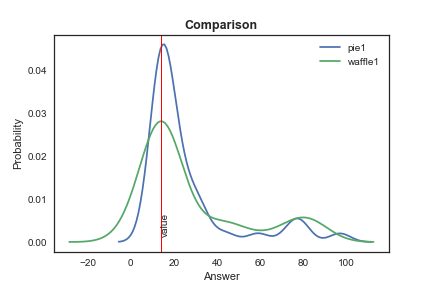

### Introduction

This experiment has as its main goal to compare how different visualisation strategies affect perception of proportions. To do so, two different types of charts will be used, pie charts and waffle charts. Since pie charts are notoriously hard to read (Cairo, 2016), this should provide an interesting exercise. However, since it is one of the most familiar plots (idem), it is also one that should be given attention and have its functionality questioned.

To get the users to focus solely on the proportions, we used made-up data about preferences for ice cream flavours, since this should prove uncontroversial. To provide some variation, flavours and proportions vary along the experiment, but are overall consistent. The questions were prepared in Qualtrics and randomisation was used to set up the questions. A timer of 15 seconds per question was also set up, but it did not work as intended.

In order to explore this issue to the fullest, we shall also try to determine whether order and colour have an effect on the perception of proportion. To do so, the order in which the flavours are presented will be altered, as well as the colours for the flavours themselves. While they usually are labeled according to a colour that would be easily associated with the flavour, for some questions some (or all) will be mislabeled.

The survey ran for 5 days and a total of 210 surveys were considered for this analysis. We collected about 40 responses per question.

### Methodology

We set up five experiments to test waffle and pie charts in five different situations. The main question behind these experiments was to find out which of the two graphs provides the most accurate information, defined as the deviation of the real data to what the reader perceives. 

For all the cases, we used up to six different flavors of ice cream to label our graphs. For each case, we used the same data and order to create a pie chart and a waffle chart. Then, we were able to compare the performance of a waffle chart versus a pie chart. In addition, in some cases, we compared the performance of slight variations of a pie or waffle chart.

To asses the difference between two vectors of results, we used four main tools. First, we used a simple t-test for the difference in the means. Second, we utilized Cohen's d, a measure that indicates the standardized difference among two means. That is to say, it is the difference in the means divided by the pooled standard deviation. Third, we built a measure of exact accuracy, which is the proportion of exactly correct answers. Fourth, we used a measure of accuracy with X units, where an answer is considered correct if it is X units above or below the exactly correct answer.

## Experiment 1

**Does the perception of the size of a slice -area- depends on the size of the other slices -areas-?**

We fixed the size of one slice -area– (vanilla), and changed the size of all the other slices –areas– in different ways. Intuitively, the best chart should represent the same data no matter if the size of the other slices –areas– changed. We tested four different combinations for the sizes of other slices –areas–. Pie 1 uses the same data as waffle 1, an so on.

*Option 1*

Concept  |   Stat
:--|--
Sample Size Pie  | 40  
Sample Size Waffle  | 45
T test indicators  | -0.36 (p=0.72)
Cohen's d  | -0.079
Pie Exact Accuracy  | 0.5
Waffle Exact Accuracy | 0.47
Pie Accuracy within 2 units | 0.43
Waffle Accuracy within 2 units | 0.62
 | |

******************************

*Option  2*

Concept  |   Stat
:--|--
Sample Size Pie  | 48
Sample Size Waffle  | 36
T test indicators  | 1.26 (p=0.21)
Cohen's d  | 0.28
Pie Exact Accuracy  | 0.06
Waffle Exact Accuracy | 0.72
Pie Accuracy within 2 units | 0.33
Waffle Accuracy within 2 units | 0.81
 | |

******************************

*Option  3*

Concept  |   Stat
:--|--
Sample Size Pie | 32
Sample Size Waffle | 40
T test indicators | 0.76 (p = 0.45)
Cohen's d | 0.18
Pie Exact Accuracy | 0.06
Waffle Exact Accuracy | 0.55
Pie Accuracy within 2 units | 0.41
Waffle Accuracy within 2 units | 0.65
 | | 

******************************
*Option  4*

Concept  |   Stat
:--|--
Sample Size Pie | 45
Sample Size Waffle | 50
T test indicators | 0.22  (p = 0.83)
Cohen's d | 0.045
Pie Exact Accuracy | 0.07
Waffle Exact Accuracy | 0.62
Pie Accuracy within 2 units | 0.47
Waffle Accuracy within 2 units | 0.72
 | | 

******************************

There are no significant differences between the pies and the waffles in the means. Then, there is not a definitive winner between pies and waffles. However, the exact accuracy is higher for waffles in all cases.

The higher accuracy of waffles might be caused by people counting squares, which might require more time against pies. Thus, further study is needed to have a better conclusion of which graph is better when there are time constraints.

******************************

## Experiment 2

**Does the total number of observations affect the reader's ability to estimate the size of a slice –area–?**

We provided the user with a total number of individuals represented in the graph. That is to say, we mentioned that the pie –waffle– represented 1000 individuals, for example.

There are two main cases: when the total number of respondents is 1000, and when the total number of respondents is 874. The intuition behind is that 874, as a non-round number, might be more difficult to interpret. 

*Option  1*

N =  1000

Concept  |   Stat
:--|--
Sample Size Pie | 72
Sample Size Waffle | 69
T test indicators | 1.62  (p = 0.11)
Cohen's d | 0.27
Pie Exact Accuracy | 0.014
Waffle Exact Accuracy | 0.0
Pie Accuracy within 2 units | 0.11
Waffle Accuracy within 2 units | 0.42
Pie Accuracy within 5 units | 0.17
Waffle Accuracy within 5 units | 0.42
 | |

******************************
*Option  2*

N =  874

Concept  |   Stat
:--|--
Sample Size Pie | 68
Sample Size Waffle | 60
T test indicators | -0.08  (p = 0.945)
Cohen's d | -0.01
Pie Exact Accuracy | 0.01
Waffle Exact Accuracy | 0.18
Pie Accuracy within 2 units | 0.06
Waffle Accuracy within 2 units | 0.27
Pie Accuracy within 5 units | 0.1
Waffle Accuracy within 5 units | 0.3
 | |

******************************

Assessment between pie charts and waffle charts showed certain differences. If we stated that the total number of respondents was 1000, the difference in means was statistically significant (10%), with a small effect size as indicated by a Cohen’s d value of 0.27. This shows that people are better at estimating with waffles. 

If we provide a non-round number of respondents, 874, this difference disappears. It must be said that exact accuracy is low, but this is likely because the way to input the answer was using a slider bar, so accuracy within two units was high. For example, when a correct answer was 140, there are a large number of answers that are either 139 or 141. 

Accuracies are higher for waffles than pies in both cases, when n = 1000, and n = 874.

******************************

## Experiment 3

**Does the position of the slice –area– affect the perception of its size?**

If a graph is robust, it should be so not matter where the data of certain category is located. Then, for instance, if a slice is located in the top of a pie chart –or waffle chart–, it should be perceived as being the same size as if it were in the bottom of the pie chart –waffle chart–.

For the pie chart, we fixed the location of all slices except one, which we rotate in the graph. For the waffle chart, we conducted a similar process. 

To asses the perception of size, we asked about the relative size of two slices –areas–. In specific, the question was: **is the size of the orange slice bigger than the lemon slice?**

Besides, we also conducted tests on whether adjacency to other slices affect its perception of size. To fully explore this, we used both apparently very different quantities, and those that were close enough to each other to be confusing.

*Option  1: Adjacent slices or areas*

Concept  |   Stat
:--|--
Sample Size Pie | 93
Sample Size Waffle | 110
T test indicators | 2.01  (p = 0.046)
Cohen's d | 0.29
Pie Exact Accuracy | 0.77
Waffle Exact Accuracy | 0.88
 | | 

******************************

*Option  1: Opposite slices or areas*

Concept  |   Stat
:--|--
Sample Size Pie | 74
Sample Size Waffle | 64
ttest | 3.25  (p = 0.001)
cohen's d | 0.55
Pie Exact Accuracy | 0.65
Waffle Exact Accuracy | 0.87
 | | 

******************************

When assessing the size of adjacent slices with visibly different proportions,  the difference between pies and waffles was statistically significant in both cases, with p = 0.04, and p = 0.001 respectively. People were able to assess the size more accurately with waffles than pies for both cases. The effect size was small when slices were adjacent (Cohen’s d = 0.2866), but bigger when they were not (Cohen’s d = 0.5472). 

It can also be inferred that it is easier to compare slices when they are adjacent, as can be seen from the statistically significant, and the small effect size. Accuracy also rises for adjacent slices.

When looking at waffles specifically, there is hardly any difference, but both accuracies are still higher than those of corresponding pies.

******************************

## Experiment 4 

**Does the distance between slices affect the ability to sum?**

We asked survey takers to sum two slices –areas– in the graph. Then, we compared that number with the data. We used two cases, one where the size of the slices was similar, and another where the size of the slices was evidently different.

The question was: **what proportion of customers prefer chocolate and vanilla?**

*Option 1: Sum adjacent slices -areas- when the size of the areas are similar*

Concept | Stat
:--|--
Sample Size Pie | 65
Sample Size Waffle | 72
T test indicators |   1.64  (p = 0.1)
Cohen's d |  0.2813
Pie Exact Accuracy |  0.28
Waffle Exact Accuracy |  0.51
Pie Accuracy within 2 units |  0.38
Waffle Accuracy within 2 units |  0.57
||

******************************

*Option 2: Sum non adjacent slices -areas- when the size of the slides -areas- are similar*

Concept | Stat
:--|--
Sample Size Pie | 113
Sample Size Waffle | 108
T test indicators |    1.02  (p = 0.31)
Cohen's d |  0.14
Pie Exact Accuracy |  0.17
Waffle Exact Accuracy |  0.43
Pie Accuracy within 2 units |  0.26
Waffle Accuracy within 2 units |  0.55
||

******************************

For the case of adjacent slices –areas– when the size of the slices is similar, the waffles have a better performance than the pies, however with a small effect size.

When we ask to sum non-adjacent slices, the difference between pies and waffles is not statistically significant.

******************************

*Option 3: compare two class of sums in pie graphs: adjacency sums and no-adjacency sums*

Concept | Stat
: --|--
Sample Size adjacent | 65
Sample Size opposite | 113
T test indicators |  0.18  (p = 0.86)
Cohen's d |  0.03
Adjacent Exact Accuracy |  0.28
Opposite Exact Accuracy |  0.17
Adjacent Accuracy within 2 units |  0.38
Opposite Accuracy within 2 units |  0.26
||

******************************

*Option 4: compare two class of sums in waffles: adjacency sums and no-adjacency sums*

Concept | Stat
: --|--

Sample Size adjacent | 72
Sample Size opposite | 108
T test indicators |      -0.82  (p = 0.41)
Cohen's d |  -0.12
Adjacent Accuracy |  0.51
Opposite Accuracy |  0.43
Adjacent Accuracy within 2 units |  0.57
Opposite Accuracy within 2 units |  0.55
||

******************************

For pies and waffles, there is no statistically significant difference between sums of adjacency slices –areas– and sums of no-adjacent slices –areas–.

******************************

*Option 5: Sum adjacent slices -areas- when the size of the slices -areas- are quite different*

Concept | Stat
:--|--
Sample Size Pie | 71
Sample Size Waffle | 77
T test indicators |   2.81  (p = 0.005)
Cohen's d |  0.46
Pie Exact Accuracy |  0.07
Waffle Exact Accuracy |  0.04
Pie Accuracy within 2 units |  0.13
Waffle Accuracy within 2 units |  0.04
||

******************************

*Option 6: Sum no-adjacent slices -areas- when the size of the slices -areas- are quite different*

Concept | Stat
: --|--
Sample Size Pie | 97
Sample Size Waffle | 97
T test indicators |   -1.12  (p = 0.27)
Cohen's d |  -0.16
Pie Exact Accuracy |  0.13
Waffle Exact Accuracy |  0.0
Pie Accuracy within 2 units |  0.25
Waffle Accuracy within 2 units |  0.02
||

******************************
For the adjacency case, when summing slices –areas– of different sizes, the pies perform better than the waffles. The overall accuracy and the exact accuracy is higher for pie charts. 

For the no-adjacency case, pies and waffles have a similar performance.
******************************

## Experiment 5

**Does the correct labelling of the charts affect perception of the proportions in them?**

We hypothesise that mislabelling, for example, using a cream colour to represent chocolate, might cause confusion. In this experiment, we did not necessarily use colours eviently associated with the flavours in all of the slices –areas–. Then, we asked about the proportion of one slice –area–. 

The question was: **what proportion of the respondents prefer vanilla ice cream?** We had examples where only vanilla was correctly labelled, examples in which only vanilla was mislabelled, and examples in which no colour was correctly labelled.

******************************

*Option 1: Pies vs Waffles. Only vanilla is mislabelled*

Concept | Stat
:--|--
Sample Size Pie | 52
Sample Size Waffle | 56
T test indicators |  -0.88  (p = 0.38)
Cohen's d |  -0.17
Pie Exact Accuracy |  0.08
Waffle Exact Accuracy |  0.64
Pie Accuracy within 2 units |  0.5
Waffle Accuracy within 2 units |  0.73
||

******************************

*Option 2: Pies vs Waffles. Vanilla is right, the rest are wrong*

Concept | Stat
:--|--
Sample Size Pie | 48
Sample Size Waffle | 48
T test indicators |   0.9  (p = 0.37)
Cohen's d |  0.18
Pie Exact Accuracy |  0.04
Waffle Exact Accuracy |  0.62
Pie Accuracy within 2 units |  0.39
Waffle Accuracy within 2 units |  0.69
||

******************************

*Option 3: Pies vs Waffles. Everything is mislabelled*

Concept | Stat
:--|--
Sample Size Pie | 59
Sample Size Waffle | 56
T test indicators |     0.48  (p = 0.63)
Cohen's d |  0.09
Pie Exact Accuracy |  0.02
Waffle Exact Accuracy |  0.21
Pie Accuracy within 2 units |  0.19
Waffle Accuracy within 2 units |  0.23
||

******************************
In any of the three former cases, no clear difference between pie charts and waffle pies emerges because there is not a significant difference. The colour labels, apparently, does not have any effect on the perception of proportions.
******************************

*Option 4: Pie 1 vs Pie 2. Only vanilla is mislabeled vs Everything is mislabeled but vanilla*

Concept | Stat
:--|--
T test indicators |      -1.84 (p = 0.07)
Cohen's d |  -0.37
p1 Exact Accuracy |  0.08
p2 Exact Accuracy | 0.04
p1 Accuracy within 2 units |  0.5
p2 Accuracy within 2 units |  0.39
||

*Option 5: Pie 2 vs Pie 3. Everything is mislabeled but vanilla vs Everything mislabelled*

Concept | Stat
:--|--
T test indicators |   -0.42  (p = 0.68)
Cohen's d |  -0.08
p3 Exact Accuracy |  0.02
p2 Exact Accuracy |  0.04
p3 Accuracy within 2 units |  0.19
p2 Accuracy within 2 units |  0.39
||

*Option 6: Pie 1 vs Pie 3. Only vanilla is mislabeled vs Everything mislabelled*

Concept | Stat
:--|--
T test indicators |  1.95  (p = 0.05)
Cohen's d |  0.37
p3 Exact Accuracy |  0.02
p1 Exact Accuracy |  0.08
p3 Accuracy within 2 units |  0.19
p1 Accuracy within 2 units |  0.5
||

******************************
All in all, pie 1 is better than pie 2 and 3. However, the significance is low ~0.06. 

Then, we can conclude that there is partial evidence that only modifying the color of the label of the flavor that you ask for might increase the accuracy in the perception of the proportion of that flavor.  

Any other change in labelling is not statistically significant against other cases.
******************************

*Option 7: Different options in labeling of waffles*

We conducted exactly the same comparisons among waffles. However, it was not a significant difference among any of the cases. Then, apparently, pies are slightly more sensitive to incorrect labeling. 

## Conclusions

All in all, waffle charts allow for greater accuracy than pie charts. All throughout the range of questions, they consistently outperformed the pie charts. For instance, in experiment 1, the perception of the size of one slice –area– was less affected in the case of waffles than in pie charts. In the same vein, in experiment 2, waffles are less sensitive to the number of respondents shown in the graph. Also, waffles outperform pies in experiment 3 about the position of the slices. The different location of the areas affects less the perception that different positions of the slices. However, experiment 4 gave us mixed results. In the case of adjacent sums for similar area sizes, waffles were better, but for adjacent sums of different sizes, pies were superior. Finally, experiment 5 shows that labeling has a not statistically different effect in pies against waffles.  

One of the limitations of this study is that even when we found that in experiment 1, 2, and 3 waffles outperform pies, maybe waffles take more time to be interpreted. Then, maybe waffles are not the best option sometimes, but more research is needed to asses timing issues.

Thus, waffle charts, emerge as clear winners on the attribute of functionality. As for beauty, it might be argued that people prefer pie charts, but this might simply be simply because they are used to them. However, there is no reason for which waffle charts should not become a more widespread visualization tool since they offer significant advantages.

## Appendix

For the vizualisations and survey construction see [the appendix](appendix.Rmd).
