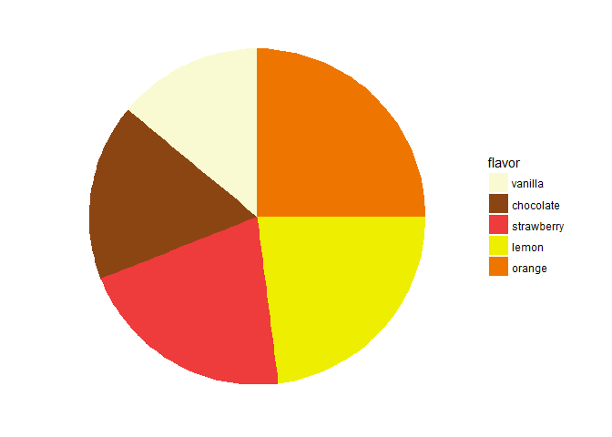
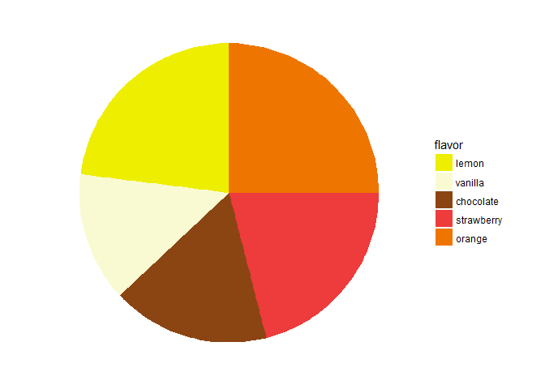
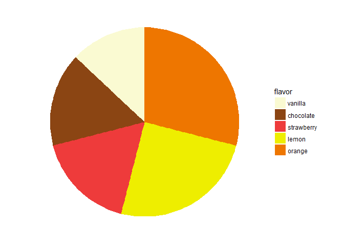
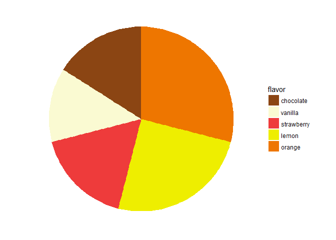

Three\_Four
================
Beau Harrison. Edits: Rodrigo Valdes
April 25, 2018

``` r
# General issues
blank_theme <- theme_minimal()+
  theme(
  axis.title.x = element_blank(),
  axis.title.y = element_blank(),
  panel.border = element_blank(),
  panel.grid=element_blank(),
  axis.ticks = element_blank(),
  plot.title=element_text(size=14, face="bold")
  )
```

``` r
# Function to create  pie
pie_function <- function(df, order, color_baseline, flavor) {
  
  df$flavor <- factor(df$flavor, flavor[order])
  color_array <- color_baseline[order]
  
  bp <- ggplot(df, aes(x="", y=number, fill = flavor)) + 
    geom_bar(width = 1, stat = "identity")

  pie <- bp + coord_polar("y", start=0)

  pie +  
    blank_theme + theme(axis.text.x=element_blank()) + 
    scale_fill_manual(values= color_array)
}
```

3. One to one comparisons.
==========================

Question: Is the size of the orange slice bigger than the lemon slice?

Intuition: Does the position matter?

``` r
flavor <- c('vanilla','chocolate','strawberry', 'lemon', 'orange')
number <- c(15, 18, 22, 24, 27)
order_1 = c(1,2,3,4,5)
order_2 = c(1,2,3,5,4)
order_3 = c(4,1,2,3,5)
order_4 = c(1,4,2,3,5)
order_5 = c(1,2,4,3,5)


three_df <- data.frame(flavor, number)
# Factor (the first thing is the input, the order is in the second)

color_baseline = c("lightgoldenrodyellow", "chocolate4", "brown2", "yellow2", "darkorange2")
```

``` r
pie_function(three_df, order_1, color_baseline, flavor)
```



``` r
pie_function(three_df, order_2, color_baseline, flavor)
```


``` r
pie_function(three_df, order_3, color_baseline, flavor)
```


``` r
pie_function(three_df, order_4, color_baseline, flavor)
```


``` r
pie_function(three_df, order_5, color_baseline, flavor)
```



4. Believes about ordering of slices
====================================

Question: Which proportion is bigger? Lemon or orange? Vanilla or chocolate?

Intutition: Do people think that slices are ordered according to sizes?

``` r
flavor <- c('vanilla','chocolate','strawberry', 'lemon', 'orange')
number <- c(14, 17, 18, 26, 30)

# General Ordering 1
# Baseline
order_1 = c(1,2,3,4,5)
# Change lemon
order_2 = c(1,2,3,5,4)
# Change vanilla
order_3 = c(2,1,3,4,5)

# General Ordering 2 (reverse order)
# Baseline
order_4 = c(5,4,3,2,1)
# Chnage lemon 
order_5 = c(4,5,3,2,1)
# Change vanilla
order_6 = c(5,4,3,1,2)

four_df <- data.frame(flavor, number)
# Factor (the first thing is the input, the order is in the second)

color_baseline = c("lightgoldenrodyellow", "chocolate4", "brown2", "yellow2", "darkorange2")
```

``` r
# Which slice is bigger? Lemon or orange? 
pie_function(four_df, order_1, color_baseline, flavor)
```



``` r
# Which slice is bigger? Lemon or orange? 
pie_function(four_df, order_2, color_baseline, flavor)
```


``` r
# Which slice is bigger? Vanilla or chocolate?
pie_function(four_df, order_3, color_baseline, flavor)
```


``` r
# Which slice is bigger? Lemon or orange? 
pie_function(four_df, order_4, color_baseline, flavor)
```


``` r
# Which slice is bigger? Lemon or orange? 
pie_function(four_df, order_5, color_baseline, flavor)
```



``` r
# Which slice is bigger? Vanilla or chocolate? 
pie_function(four_df, order_6, color_baseline, flavor)
```


