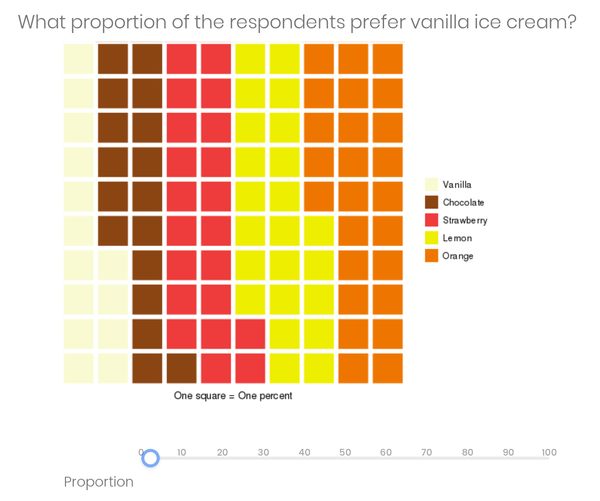
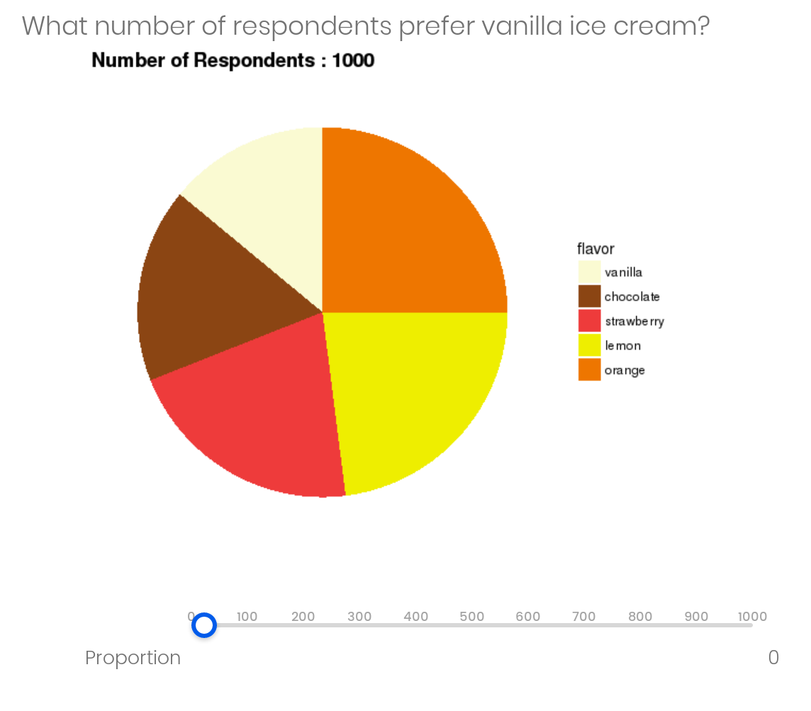
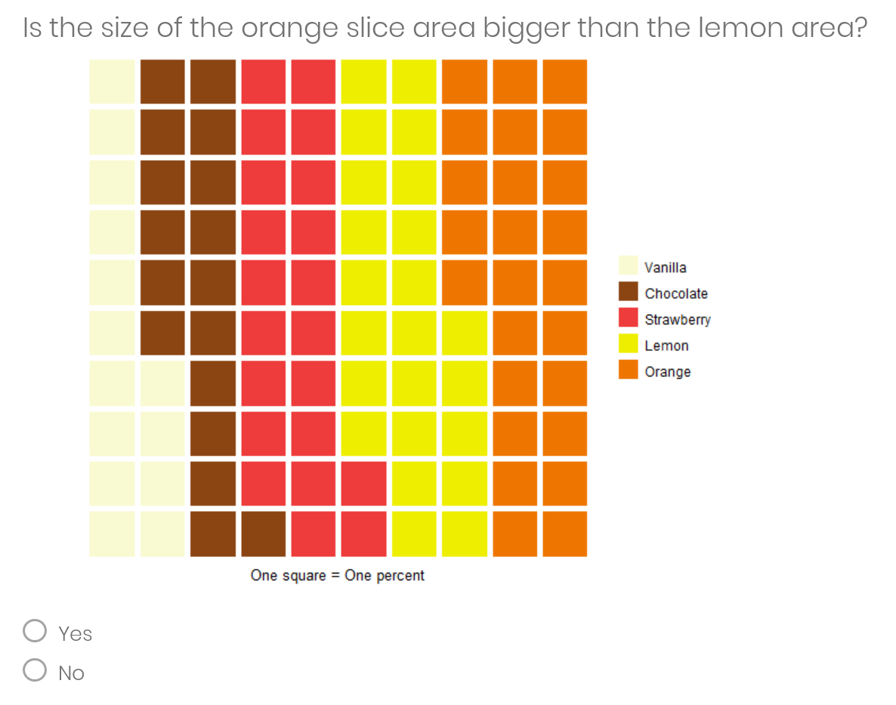
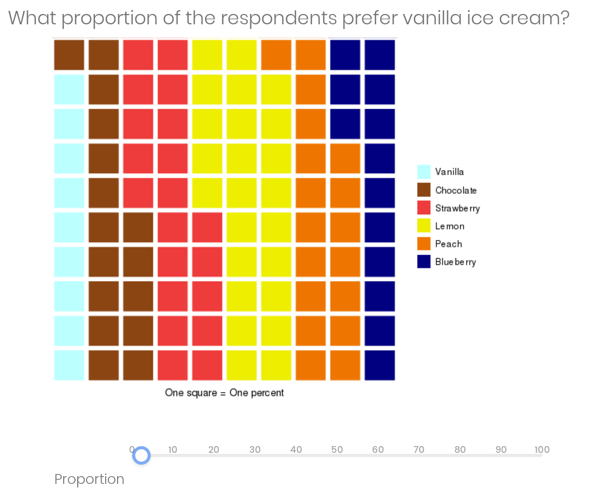

Below is an example of the questions on the survey. The first larger image was captured from the survey showing the exact Qualtrics configuration along with the slider for user input. Second, each of the variants that were chosen at random to be shown to a survey participant. To be clear a single respondent would have only seen one pie chart and one waffle chart from each experiment.

## Experiment 1

**Does the perception of the size of a slice -area- depends on the size of the other slices -areas-?**

*Example questions*

*Variants of the question*

<!-- --><!-- -->

## Experiment 2

**Does the total number of observations affect the reader's ability to estimate the size of a slice –area–?**

*Example questions*

*Variants of the question*

<!-- --><!-- -->

## Experiment 3

**Does the position of the slice –area– affect the perception of its size?**

Specifically: **Is the size of the orange slice bigger than the lemon slice?**

*Example questions*

*Variants of the question*

<!-- --><!-- -->

## Experiment 4 

**Does the distance between slices affect the ability to sum?**

Specifically: **What proportion of customers prefer chocolate and vanilla?**

*Example questions*

*Variants of the question*

<!-- --><!-- -->

## Experiment 5

**Does the correctness of labeling of the charts affect perception of the proportions in them?**

Specifically: **What proportion of the respondents prefer vanilla ice cream?**

*Variants of the question*

<!-- --><!-- -->

